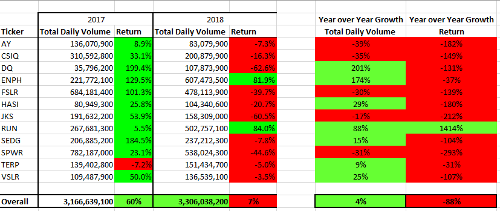
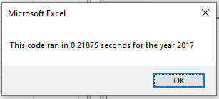
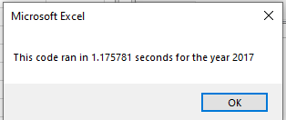
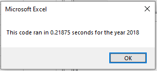
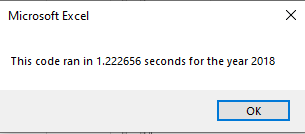

# Stock-Analysis

## Overview of Project 
The goal of this project is to assist Steve, a recent Finance graduate, with analyzing the his parents investment.
His parents have invested into one stock (ticker symbol: **DQ**) in an area that they are passionate about. Steve wants to explore this investment for current and future profitability and also explore opportunities to diversify.

## Results 
### 2017 vs 2018 Stock Performance

**2017:** Returns in this space were positive at an average of 60% of those stocks compared. Only one stock reflected negative returns: TERP -7.2%
**2017:** The stock choice of Steve's parents **DQ** reflected the highest return rate for this year with the lowest volume of those compared.**

**2018:** Only one stock increased in both Daily Volume and Returns: _**RUN**_  
**2018:** Out of the stocks compared **DQ** reflected the largest Daily Volume Increase year over year at 201%, while negatively accompanied by the lowest rate of return for this year. 

**Summary:** If investments are to continue in this sector, shifting investments to the **RUN** stock is recommended. 

### Execution Script Times (Original vs Refactored)
   _Refactored_
        _Original_

**The 2017 Refactored script ran 81.4% faster.**

   _Refactored_
        _Original_

**The 2018 Refactored script ran 82.11% faster.**

## Summary: 
**What are the advantages or disadvantages of refactoring code?**

_1. Advantages:_
- Allows for a larger volume of data to be analyzed
- Allows for this analysis to occur more efficiently

_2. Disadvantage:_
- The time it takes to recreate and revise
- Maintaining the integrity of the essential components of the original script can be somewhat challenging

**How do these pros and cons apply to refactoring the original VBA script?**

Although the cons (disadvantages) listed above can be time consuming, and requires a very thorough comparison review, the pros (advantages) far outweigh any negative aspect. In this particular scenario, refactoring the code will allow Steve to analyze a much larger volume of stocks in any given sector quickly. Thereby allowing him to give more timely reccomendations, based on a larger spectrum of data. One could argue that only comparing 2017 and 2018 is not enough data to confidently recommend divesting from **DQ** in this sector given **DQ**'s rapid year over year growth. Is this how this sector trends? Is there an outlier event that occurred in 2018 that would become more apparent if a 10 year analysis were conducted?

